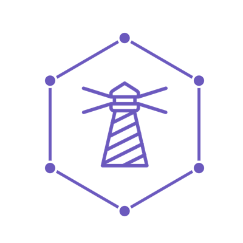

## Lighthouse Tutorial


## [Entity-Relationship](https://en.wikipedia.org/wiki/Entity%E2%80%93relationship_model) to [SQL](https://en.wikipedia.org/wiki/SQL)


```
php artisan migrate
```

## Models generation from [SQL](https://en.wikipedia.org/wiki/SQL)

```
php artisan code:models
```

## Clients

- [react-apollo-blog](https://github.com/noud/react-apollo-blog) [React Apollo](https://www.apollographql.com/docs/react/)
- [react-admin-data-opencrud](https://github.com/noud/react-admin-data-opencrud) [React Admin](https://marmelab.com/react-admin/) [ra-data-opencrud](https://github.com/weakky/ra-data-opencrud#readme) conform [OpenCRUD](https://www.opencrud.org) [ra-data-graphql](https://github.com/marmelab/react-admin/tree/master/packages/ra-data-graphql)
- [react-admin-data-graphql-simple](https://github.com/noud/react-admin-data-graphql-simple) [React Admin](https://marmelab.com/react-admin/) [ra-data-graphql-simple](https://github.com/marmelab/react-admin/tree/master/packages/ra-data-graphql-simple) [ra-data-graphql](https://github.com/marmelab/react-admin/tree/master/packages/ra-data-graphql)

<div align="center">
  <a href="https://www.lighthouse-php.com">
    
  </a>
</div>

<div align="center">

# Lighthouse [GraphQL](https://en.wikipedia.org/wiki/GraphQL) Server for Laravel

[](https://travis-ci.org/nuwave/lighthouse)
[](https://codecov.io/gh/nuwave/lighthouse)
[](https://github.com/phpstan/phpstan)
[](https://github.styleci.io/repos/59965104)
[](https://packagist.org/packages/nuwave/lighthouse)
[](https://github.com/nuwave/lighthouse/blob/master/LICENSE)
[](https://join.slack.com/t/lighthouse-php/shared_invite/enQtMzc1NzQwNTUxMjk3LWI1ZDQ1YWM1NmM2MmQ0NTU0NGNjZWFkMTJhY2VjMDAwZmMyZDFlZTc1Mjc3ZGY0MWM1Y2Q5MWNjYmJmYWJkYmU)

</div>

<p align="center"></p>

<p align="center">
<a href="https://travis-ci.org/laravel/framework"></a>
<a href="https://packagist.org/packages/laravel/framework"></a>
<a href="https://packagist.org/packages/laravel/framework"></a>
<a href="https://packagist.org/packages/laravel/framework"></a>
</p>